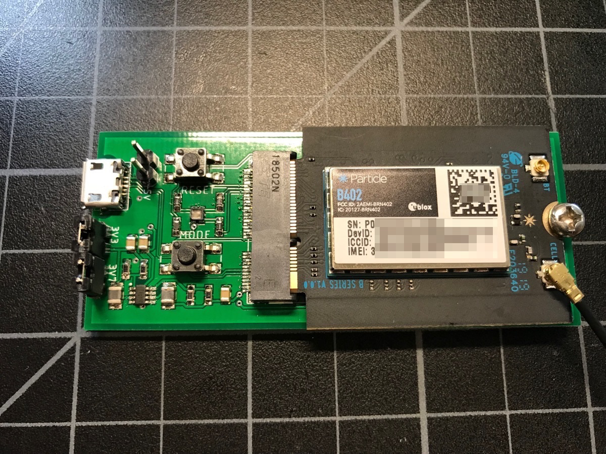

# SoM First Board

The tutorial can be found here: [https://docs.particle.io/tutorials/hardware-projects/som-first-board/](https://docs.particle.io/tutorials/hardware-projects/som-first-board/)

This repository contains the Eagle design files for the board used in the example.

- SomUSB2.sch - Schematic file for EagleCAD
- SomUSB2.brd - Board file for EagleCAD
- schematic.pdf - Schematic (PDF)
- board.pdf - Board (PDF)
- SomUSB1.lbr - Eagle library file with all of the parts used in the design
- SomUSB2v2.zip - Gerber files

### Version History

#### 2020-03-30 (v2)

- Changed R8 from 158K to 150K to change 3V7 to 3V8. The voltage increase to 3.875V adds an extra safety margin for some modem modules.

#### 2019-10-24

- Updated M.2 standoff

#### 2019-05-20

- Initial version
